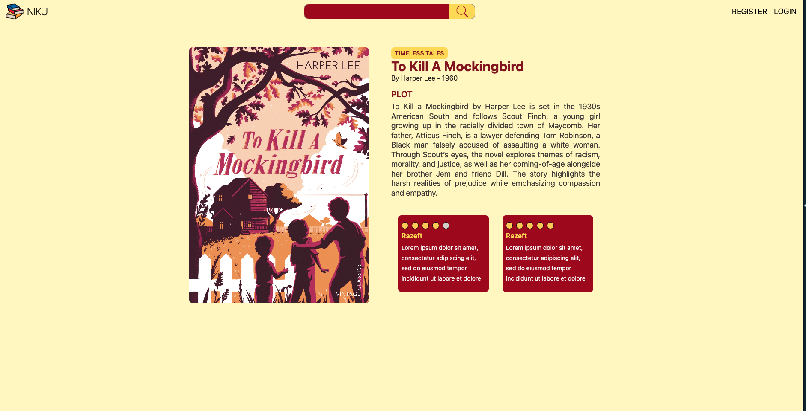

# 📚 BookReviewApp

**BookReviewApp** is a full-stack web application for managing and reviewing books.  
Built with **Angular** on the front end and **Java + Spring Boot** on the back end.

## 🧩 Project Overview

This app allows users to browse a collection of books, leave comments, and rate them.  
It also includes an **admin dashboard** to manage users and books.

### 👥 Roles

- **Admin**

  - Access to a dashboard interface
  - Add, edit, or remove books
  - Manage registered users

- **User**
  - View and search for books
  - Add comments and star ratings
  - See reviews from other users

## 🛠️ Tech Stack

- **Frontend:** Angular
- **Backend:** Java + Spring Boot
- **Database:** MySQL

## 📸 Screenshots

Screenshots of the app are available in the [`screenshots/`](./screenshots) folder.

## 🚧 Deployment

This project is not currently deployed online.

## 📄 License

This project is open source and available under the [MIT License](LICENSE).
